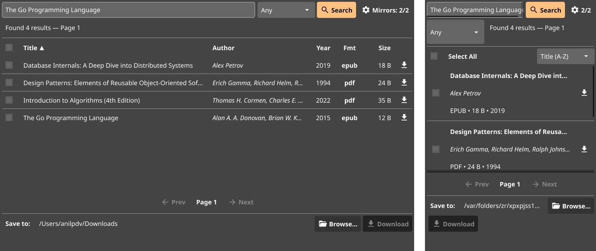

# LibGen Downloader (Fyne GUI)

[](https://github.com/anilpdv/libgen-gui)
[](https://goreportcard.com/report/github.com/anilpdv/libgen-gui)
[](LICENSE)
[](https://github.com/anilpdv/libgen-gui/releases)

A fast, lightweight, native cross-platform desktop and mobile app for searching, discovering, and downloading books and research papers from Library Genesis mirrors.

Built with **Go** and the **Fyne v2** vector UI toolkit for 100% native performance with zero webview overhead.

---

<p align="center">
  
</p>

---

## 📱 Platform Verification & Support

| Platform | Verification Status | Target Package | Download |
|---|:---:|:---:|---|
| **macOS (Apple Silicon & Intel)** | ✅ **Primary Verified & Tested** | Native `.app` / `.zip` | [Download macOS Build](https://github.com/anilpdv/libgen-gui/releases) |
| **Android (API 26–35)** | ✅ **Primary Verified & Tested** | Signed `.apk` (SAF support) | [Download Android APK](https://github.com/anilpdv/libgen-gui/releases) |
| **Linux** | 🔄 Cross-compilation supported | Native binary / `.tar.gz` | [Build from Source](#building--running) |
| **Windows** | 🔄 Cross-compilation supported | Native `.exe` | [Build from Source](#building--running) |
| **iOS** | 🔄 Simulator build supported | `.app` package | [Build from Source](#building--running) |

> [!NOTE]
> **macOS** and **Android** are the primary development and daily-driver targets, featuring tailored responsive layouts and native storage adapters (including Android Storage Access Framework).

---

## ✨ Key Features

- **Adaptive Dual-View Layout**: Automatic responsive switching between desktop tabular sorting and touch-friendly mobile cards.
- **Embedded Resilient Core**: Bundled `pkg/libgen` engine with multi-mirror automatic failover and IPFS gateway routing.
- **Live Mirror Health Prober**: Background latency tester that monitors active mirrors in real time with priority selection.
- **Interactive Download Queue**: Serialized FIFO queue with pause, resume, cancel, and row-level progress tracking.
- **Android Storage Access Framework (SAF)**: Full support for Android 11+ scoped storage and SD card folder selection (`content://` URIs).
- **Instant System Viewer**: 1-click open directly in Apple Books, Moon+ Reader, SumatraPDF, or your OS default reader.
- **Zero Webview Bloat**: Compiles to a lightweight native binary powered by OpenGL/Metal hardware acceleration.

---

## 🚀 Installation & Releases

### 📥 Download Pre-built Releases
Grab ready-to-run releases from the [GitHub Releases](https://github.com/anilpdv/libgen-gui/releases) page:
- **macOS**: `LibGen-Downloader-macOS.zip` (unzip and open `LibGen Downloader.app`)
- **Android**: `LibGen-Downloader-Android.apk` (install on any Android 8.0+ device)

---

## 🛠️ Building from Source

### Prerequisites
- Go 1.22+
- C compiler (`clang` on macOS, `gcc` on Linux/Windows)
- Fyne CLI (`go install fyne.io/fyne/v2/cmd/fyne@latest`)

### Run in Development
```bash
go run main.go
```

### Build Desktop App (macOS)
```bash
fyne package -os darwin -icon icon.png -appID com.libgen.downloader -name "LibGen Downloader"
```

### Cross-Compile for Android (APK)
```bash
fyne-cross android -app-id com.libgen.downloader -icon icon.png
```

---

## 🧪 Testing

```bash
# Run unit & UI component tests
go test ./ui ./pkg/libgen -v

# Run storage normalization and queue worker tests
go test -v ./ui -run "TestDownloadQueue|TestNormalizePath"
```

---

## 📄 License
Licensed under the [MIT License](LICENSE).
