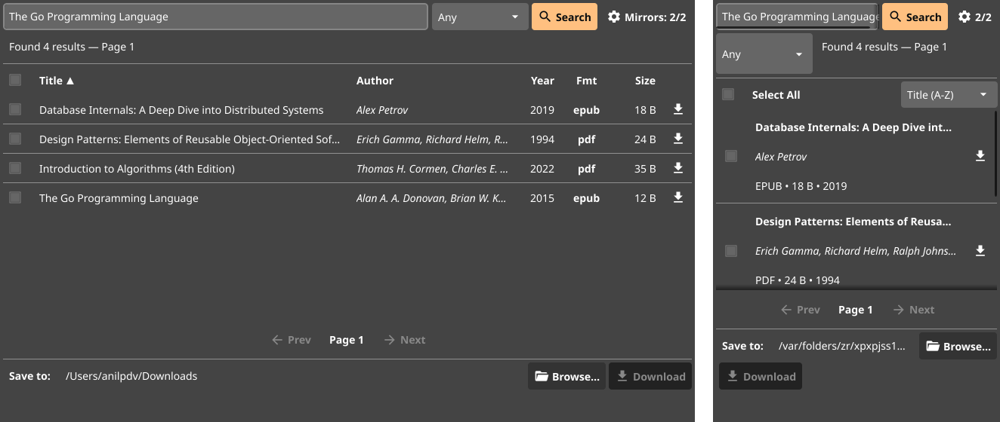

# LibGen Downloader (Native Go + Fyne GUI)

[](https://github.com/anilpdv/libgen-gui/actions/workflows/ci.yml)
[](https://anilpdv.github.io/libgen-gui)
[](https://goreportcard.com/report/github.com/anilpdv/libgen-gui)
[](LICENSE)
[](https://github.com/anilpdv/libgen-gui/releases)

> 🌐 **Official Website & Documentation**: [https://anilpdv.github.io/libgen-gui](https://anilpdv.github.io/libgen-gui)

A fast, lightweight, native cross-platform desktop and mobile application for searching, discovering, and downloading books and research papers from Library Genesis mirrors.

Built with **Go** and the **Fyne v2** vector UI toolkit for 100% native performance with zero webview or Electron overhead.

---

<p align="center">
  
</p>

---

## 📱 Platform Verification & Support

| Platform | Verification Status | Target Package | Download |
|---|:---:|:---:|---|
| **macOS (Apple Silicon & Intel)** | ✅ **Primary Verified & Tested** | Native `.app` / `.zip` | [Download macOS Build (v2.0.1)](https://github.com/anilpdv/libgen-gui/releases) |
| **Android (API 26–35)** | ✅ **Primary Verified & Tested** | Signed `.apk` (SAF support) | [Download Android APK (v2.0.1)](https://github.com/anilpdv/libgen-gui/releases) |
| **Linux (X11 / Wayland)** | 🔄 Verified & Cross-compilation ready | Native binary / `.tar.gz` | [Build from Source](#building--running) |
| **Windows (10 / 11)** | 🔄 Verified & Cross-compilation ready | Native `.exe` | [Build from Source](#building--running) |

---

## ✨ Key Features (v2.0.1)

- **Decoupled Clean Architecture**: Layered domain boundaries across `internal/network`, `internal/storage`, `internal/search`, `internal/download`, `internal/settings`, and `internal/app`.
- **Configurable Download Destinations**:
  - **Desktop**: Select any local directory via native folder picker; open directly in Finder/Explorer/File Manager.
  - **Android**: Scoped storage folder selection via Android Storage Access Framework (SAF) document tree URIs.
  - **Destination Persistence**: Preserves chosen folder across restarts and upgrades seamlessly.
  - **Per-Task Destination Isolation**: Queued downloads retain the destination captured at enqueue time; changing folders applies strictly to new tasks without interrupting active `.part` downloads.
- **Compact, Responsive Desktop & Mobile UI**:
  - **Maximized Results Viewport**: Center results table expands to dominate the window (displaying 12–15+ visible rows on standard displays).
  - **Clean Pagination Toolbar**: Compact `[Previous] Page N [Next]` bar without redundant page status duplication.
  - **Streamlined Download Footer**: Compact single-row action bar featuring folder icon, `~/path` truncation, `Change`, `Open Folder`, and dynamic multi-book selection counters.
- **Comprehensive Settings Modal**:
  - **Downloads**: Current destination, change location, open in file manager, reset to default, post-download auto-open, and existing-file behavior (rename, overwrite, skip).
  - **Network**: Configurable HTTP request timeouts and retry limits.
  - **Mirrors**: Automatic vs preferred mirror selection, live latency health list, and manual prober triggers.
  - **Appearance**: System, Light, and Dark theme toggles.
- **Multi-Mirror Automatic Failover**: Continuous background latency probing and automatic failover across official mirrors (`libgen.is`, `libgen.rs`, `libgen.st`, `libgen.li`).
- **Atomic Resumable Downloads**: Temporary `.part` file isolation with HTTP Range chunk resumption and atomic rename upon completion.
- **Crash-Safe Queue Persistence**: Thread-safe FIFO queue backed by atomic `.tmp` JSON serialization with destination migration for recovered tasks.
- **Zero Webview Overhead**: Compiles to a single static binary consuming under 35MB RAM, powered by OpenGL/Metal hardware acceleration.

---

## 🧭 Download Destination & Queue Behavior

```
Settings Screen / Download Bar
             │
             ▼
    Settings Controller
             │
      ┌──────┴──────────────────────────┐
      ▼                                 ▼
Settings Repository             Target Provider
 (Persists location)           (Updates for new tasks)
                                        │
                                        ▼
                                Download Manager
                                        │
                    ┌───────────────────┴───────────────────┐
                    ▼                                       ▼
        Active / Queued Tasks                           New Tasks
    (Retain captured destination)              (Use new target location)
```

1. **Active Downloads**: Continue streaming to their original destination without file movement.
2. **Queued Tasks**: Retain the destination captured when they were enqueued.
3. **New Tasks**: Automatically resolve and use the newly selected destination.

### Troubleshooting
- **Android SAF Access Revoked**: If Android revokes access to an external document tree, open **Settings → Downloads → Change Folder** and re-select the folder.
- **Unwritable Directory**: If the selected directory becomes unavailable or unwritable, downloads safely fall back to the user's default Downloads directory and notify via status alert.

---

## 🚀 Installation & Releases

### 📥 Download Pre-built Releases
Grab ready-to-run releases from the [GitHub Releases](https://github.com/anilpdv/libgen-gui/releases) page:
- **macOS**: `LibGen.Downloader-v2.0.1-macos.zip` (unzip and drag `LibGen Downloader.app` to `/Applications`)
- **Android**: `LibGen.Downloader-v2.0.1-android.apk` (install on Android 8.0+)
- **Desktop Binary**: `libgen-gui-v2.0.1`

---

## 🏗️ Architecture & Directory Structure

```
libgen-gui/
├── cmd/
│   └── libgen-gui/        # Application entrypoint
│       └── main.go
├── internal/
│   ├── app/               # Composition root, service wiring & dependency injection
│   ├── download/          # Download manager, worker pool, task state machine & queue persistence
│   ├── network/           # Resilient HTTP client, mirror health prober & failover
│   ├── search/            # Search service, query validation & mirror query executor
│   ├── settings/          # Typed settings model, repository & settings controller
│   └── storage/           # Storage abstraction, desktop filesystem & Android SAF adapters
├── pkg/
│   └── libgen/            # Reusable core LibGen HTML parser & mirror scraper
├── ui/                    # Native Fyne graphical interface (views, dialogs, widgets, theme)
├── website/               # Modern Next.js + Tailwind marketing site
└── docs/                  # GitHub Pages distribution
```

---

## 🛠️ Building from Source

### Prerequisites
- Go 1.22+
- C compiler (`clang` on macOS, `gcc` on Linux/Windows)
- Fyne CLI (`go install fyne.io/tools/cmd/fyne@latest` or `go install fyne.io/fyne/v2/cmd/fyne@latest`)

### Run in Development
```bash
go run ./cmd/libgen-gui
```

### Build Native Desktop Binary
```bash
go build -o "LibGen Downloader" ./cmd/libgen-gui
```

### Package macOS App Bundle
```bash
fyne package -os darwin -icon icon.png -appID com.libgen.downloader -name "LibGen Downloader" --src cmd/libgen-gui
```

### Cross-Compile for Android (APK)
```bash
fyne-cross android -app-id com.libgen.downloader -icon icon.png
```

---

## 🧪 Testing & Verification

```bash
# Run all tests with race detector
go test -v -race ./...

# Run internal domain tests
go test -v -race ./internal/...

# Run UI & scraper unit tests
go test -v ./ui ./pkg/libgen
```

---

## 📄 License & Legal Notice
Distributed under the [MIT License](LICENSE).

*Disclaimer: LibGen GUI is an independent search and client tool. Users are solely responsible for verifying the copyright status of files and complying with their local copyright and intellectual property laws.*
